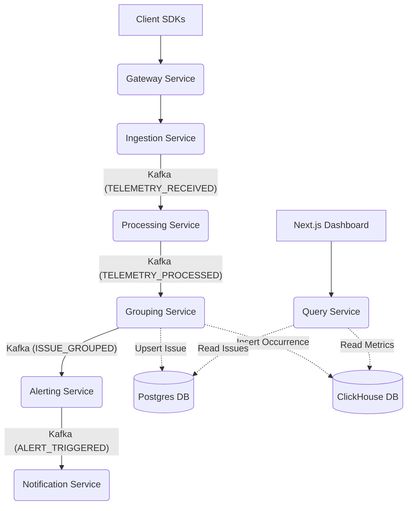

# LiteTrace Architecture Guide

Welcome to the LiteTrace repository! This document is intended as your "Day 1" onboarding manual to understand how the entire system fits together.

## 🎯 What is LiteTrace?
LiteTrace is a self-hosted, error-tracking, and sampled-APM platform. It is a focused alternative to platforms like Sentry, designed for small teams and optimized for a unified TypeScript tech stack.

## 🏗️ The Big Picture

LiteTrace operates on a **microservices architecture** connected by an **event-driven backbone (Kafka/Redpanda)**. It strictly adheres to **CQRS** (Command Query Responsibility Segregation). 

This means that the path where we *write* data (ingesting thousands of errors per second) is completely physically separated from the path where we *read* data (the dashboard querying issues).

### High-Level Topology

## 📦 Service Breakdown

### 1. Gateway Service (`apps/services/gateway`)
The public-facing HTTP surface. It handles basic routing, authentication validation, and API key verification before passing traffic to internal services.

### 2. Ingestion Service (`apps/services/ingestion`)
The high-throughput write API. It accepts raw telemetry payloads, performs extreme fast-path validation (rate limits), and immediately drops the payload onto Kafka (`TELEMETRY_RECEIVED`). It does **not** block on database writes.

### 3. Processing Service (`apps/services/processing`)
Consumes raw payloads, scrubs PII (Personally Identifiable Information), normalizes stack traces, and prepares the data for fingerprinting. Emits `TELEMETRY_PROCESSED`.

### 4. Grouping Service (`apps/services/grouping`)
The core algorithmic engine. It takes normalized stack traces, generates a deterministic **SHA-256 fingerprint hash**, and groups identical errors. 
- Upserts the grouped "Issue" into **Postgres**.
- Inserts the raw "Occurrence" into **ClickHouse** for fast searching.
- Emits `ISSUE_GROUPED`.

### 5. Alerting Service (`apps/services/alerting`)
The rules engine. It evaluates incoming `ISSUE_GROUPED` events against user-defined alert rules (e.g., "New Issue", "Spike in frequency"). If a rule matches, it emits `ALERT_TRIGGERED`.

### 6. Notification Service (`apps/services/notification`)
Handles dispatching alerts to third-party channels (Slack, Webhooks, Email). It uses Redis to implement a deduplication strategy (e.g., preventing 500 Slack messages in a minute for the same error).

### 7. Query Service (`apps/services/query`)
The CQRS read-path. The Next.js dashboard talks exclusively to this service to fetch data. It abstracts the complexity of querying both Postgres (for domain objects) and ClickHouse (for analytics).

### 8. Web Dashboard (`apps/web/dashboard`)
A Next.js App Router frontend built with React 19, Tailwind CSS, and shadcn/ui. 

---

## 🗄️ Polyglot Persistence Strategy

LiteTrace uses specific databases for specific workloads to maintain performance:

1. **Postgres + Prisma**: The source of truth for relational domain objects. Handles Users, Tenants (Workspaces), Subscriptions, Rules, and the deduplicated "Issue" definitions. Uses **Row-Level Security (RLS)** to enforce strict multi-tenant isolation.
2. **ClickHouse**: The OLAP datastore. Handles the raw, high-volume telemetry events and analytical aggregations (e.g., "how many times did this error happen yesterday?").
3. **Redis**: Used for high-speed, ephemeral state: rate-limiting (token buckets), job queues (BullMQ), and alert deduplication cooldowns.
4. **S3 / MinIO**: Used for raw blob storage (e.g., large crash dump attachments, sourcemaps).

## 🚀 Key Design Principles
As you develop in this repository, keep these rules in mind:
- **TypeScript End-to-End**: Do not introduce other languages.
- **Never Block Ingestion**: The ingest path must never go down, even if the database is struggling. Always queue.
- **SOLID Principles**: Adhere to Single Responsibility and Dependency Inversion throughout the microservices.
- **Multi-tenant by Design**: Always ensure your queries and events are scoped to a `tenantId`.
