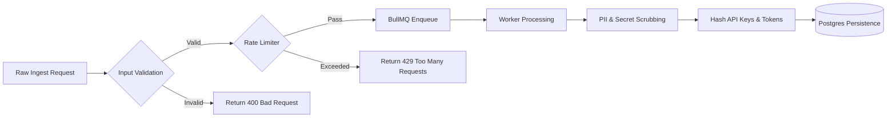
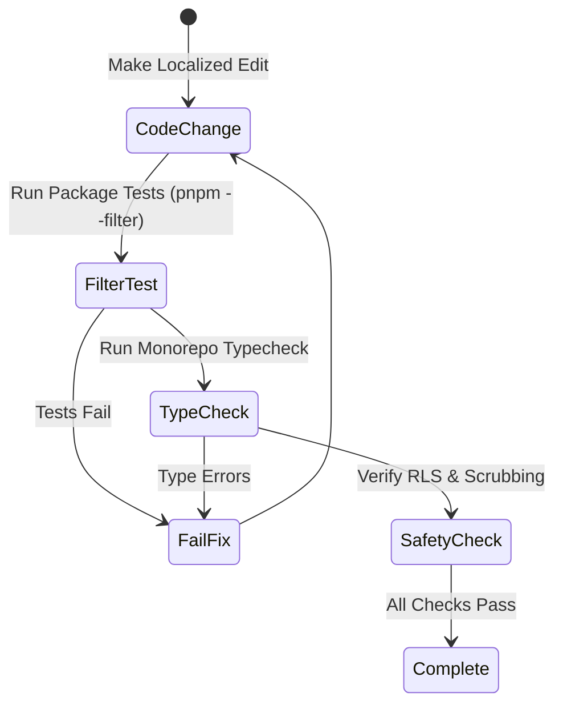

# Prod Own — Project Analysis & Governance Guidelines

This document provides an in-depth architectural analysis of the **Prod Own** codebase along with strict execution, governance, security, and verification rules for engineering agents and contributors.

---

## System Architecture Overview

```mermaid
graph TD
    Client[Client Apps / Web Browsers] -->|HTTP Telemetry POST /ingest| API[apps/api: Fastify Ingest API]
    Dashboard[apps/web: Next.js Dashboard] -->|Admin & Read APIs| API
    
    subgraph Core Runtime Services (Docker Stack)
        API -->|Enqueue Jobs| Queue[BullMQ / Redis]
        Queue -->|Process Jobs| Worker[apps/worker: Node Worker]
        API -->|Read/Write Postgres RLS| DB[(PostgreSQL 16)]
        Worker -->|Scrub & Fingerprint| DB
    end

    subgraph External Integrations
        API -->|Alert Hooks| Slack[Slack Webhook]
        API -->|Alert Hooks| SLACK[Slack Webhook]
        API -->|Payment Hooks| Razorpay[Razorpay Webhook]
    end

    subgraph Configuration & Shared Packages
        Config[@prod-own/config: Zod Env]
        Types[@prod-own/types: Shared Types]
        Obs[@prod-own/observability: OTEL SDK]
    end

    API --- Config
    Worker --- Config
    API --- Obs
    Worker --- Obs
```

---

## 1. Scope & Execution Boundaries (Preventing Runaway Changes)

To ensure long-term stability and simplicity, all development on **Prod Own** must strictly adhere to predefined architectural scope limits.

### 1.1 Hard Scope Guardrails (Forbidden Features)
The following features are **strictly out of scope** for the MVP and current repository boundary. Any request requiring these must be flagged as an explicit scope change:

> [!CAUTION]
> Do **NOT** silently add or introduce dependencies for any of the following:
> 1. **Session Replay**: Canvas/DOM recording libraries or video stream capture.
> 2. **Mobile SDKs**: iOS (Swift), Android (Kotlin/Java), or React Native client SDKs.
> 3. **Full-Fidelity Unsampled Tracing**: Heavy APM trace collectors or raw flamegraph ingestion.
> 4. **New Stateful Infrastructure**: Kafka, ClickHouse, Cassandra, Elasticsearch, or Mongo. (Core runtime is limited strictly to Postgres & Redis).
> 5. **Custom Auth-as-a-Service**: Complex custom OAuth providers or identity server architectures.
> 6. **Multi-Node Orchestration**: Kubernetes manifests, Helm charts, or service mesh configs for MVP.

### 1.2 Boundary Enforcement
- **Monorepo Structure**: Keep the monorepo single-rooted using `pnpm` workspaces (`pnpm-workspace.yaml`). Do not split services into separate git repositories.
- **Docker Stack Boundary**: Core runtime Docker services are strictly limited to 4: `postgres`, `redis`, `api`, and `worker` ([docker-compose.yml](file:///e:/Prod_Own/docker-compose.yml#L1-L76)).
- **Dashboard Isolation**: The Next.js dashboard ([apps/web](file:///e:/Prod_Own/apps/web/package.json)) runs as a separate frontend service and is **not** bundled into the Docker runtime stack.

---

## 2. Architecture & Pattern Compliance

All code introduced into the repository must conform to the established monorepo patterns and module boundaries.

### 2.1 Monorepo Module Mapping

| Package / App | Path | Primary Responsibility | Key Technologies / Contracts |
| :--- | :--- | :--- | :--- |
| **Ingest API** | [apps/api](file:///e:/Prod_Own/apps/api/src/server.ts) | HTTP telemetry ingest, alert hooks, payment webhooks | Fastify, Helmet, CORS, OTEL |
| **Background Worker** | [apps/worker](file:///e:/Prod_Own/apps/worker/src/worker.ts) | Async error fingerprinting, scrubbing, deduplication | BullMQ Worker, OTEL |
| **Web Dashboard** | [apps/web](file:///e:/Prod_Own/apps/web/package.json) | UI for error reporting and project management | Next.js 15, Tailwind CSS, shadcn/ui |
| **Database Package** | [packages/db](file:///e:/Prod_Own/packages/db/prisma/schema.prisma) | Data layer & multi-tenant isolation | Prisma ORM, PostgreSQL RLS |
| **Queue Package** | [packages/queue](file:///e:/Prod_Own/packages/queue/src/factories.ts) | Centralized queue name & Redis connection helpers | BullMQ, ioredis |
| **Config Package** | [packages/config](file:///e:/Prod_Own/packages/config/src/env.ts) | Single source of truth environment parsing | Zod schema validation |
| **Types Package** | [packages/types](file:///e:/Prod_Own/packages/types/src/index.ts) | Shared domain type definitions | Strict TypeScript interfaces |
| **Observability** | [packages/observability](file:///e:/Prod_Own/packages/observability/src/otel.ts) | OpenTelemetry collector bootstrap | `@opentelemetry/sdk-node` |

### 2.2 Interface-First & Layering Rules
1. **Define Contracts First**: Define interfaces in `@prod-own/types` ([packages/types/src/index.ts](file:///e:/Prod_Own/packages/types/src/index.ts)) or module boundaries before implementation.
2. **Single Responsibility**: Maintain one exported primary responsibility per file (e.g., [ingest.ts](file:///e:/Prod_Own/apps/api/src/routes/ingest.ts)).
3. **No Direct `process.env`**: Access environment variables **only** via the `@prod-own/config` central package (`import { env } from '@prod-own/config'`).
4. **Multi-Tenancy via Postgres RLS**: Tenant boundaries are enforced at the database level with Row-Level Security (RLS) policies scoped by `tenantId`, not by ad-hoc application `WHERE` clauses alone ([schema.prisma](file:///e:/Prod_Own/packages/db/prisma/schema.prisma#L13-L28)).
5. **Standardized Queueing**: Use BullMQ queues for retries and asynchronous background work ([packages/queue](file:///e:/Prod_Own/packages/queue/src/factories.ts)). Never write custom inline retry/backoff loops.
6. **Lean HTTP Integrations**: Use plain HTTP integrations for external alerts (Slack webhooks) and payment hooks (Razorpay APIs) to prevent vendor SDK bloat.

---

## 3. Security & Safety Rules

Security boundaries must be maintained at ingest, processing, and storage layers.



### 3.1 Data Scrubbing & Privacy
> [!IMPORTANT]
> **Scrub BEFORE persistence, never after.**
- Raw content containing stack traces, request bodies, or error messages must pass through PII and credential scrubbers (removing API keys, Bearer tokens, passwords, credit card numbers, and email addresses) prior to database insertion.

### 3.2 Key & Credential Security
- **Hashing at Rest**: API keys and auth tokens must be hashed (e.g., SHA-256 / bcrypt) before storage. Plaintext keys must never be logged or stored in database tables.
- **Secrets via Environment**: API secrets (`RAZORPAY_KEY_SECRET`, webhooks) must be passed strictly through `.env` and validated by Zod ([packages/config/src/env.ts](file:///e:/Prod_Own/packages/config/src/env.ts#L25-L46)).

### 3.3 Payload Validation & Ingest Protection
- **Pre-Queue Validation**: Ingest endpoints ([ingest.ts](file:///e:/Prod_Own/apps/api/src/routes/ingest.ts#L31-L37)) must validate structural fields (`tenantId`, `sourceId`, `content`) before enqueuing or executing DB operations.
- **Ingest Rate Limiting**: Ingest rate limits must be evaluated before payloads enter Redis or BullMQ queues to prevent denial-of-service queue flooding.

---

## 4. Verification & Self-Correction Loop

Every modification must be systematically verified using concrete, falsifiable checks before declaring completion.



### 4.1 Verification Step Execution

| Phase | Target Scope | Command | Success Criteria |
| :--- | :--- | :--- | :--- |
| **1. Package Test** | Local Package | `pnpm --filter <package-name> test` | 100% Vitest test pass rate |
| **2. Type Check** | Entire Monorepo | `pnpm typecheck` | 0 TypeScript errors (`tsc --noEmit`) |
| **3. Code Linting** | Workspace | `pnpm lint` | Zero ESLint warnings/errors |
| **4. Code Format** | Workspace | `pnpm format` | Prettier compliance across changed files |

### 4.2 Required Testing Scenarios
When implementing or modifying features, you must write/update tests covering:
1. **RLS Multi-Tenant Isolation**: Cross-project read/write isolation tests proving Tenant A cannot access Tenant B data.
2. **Scrubbing Validation**: Test cases verifying sensitive keys/PII are scrubbed from raw stack traces and JSON metadata.
3. **Hard Fingerprinting Cases**: Malformed stack traces, dynamic line numbers, and microsecond timestamp noise.
4. **Alert Cooldown**: Verification of alert rate-limiting/cooldowns during sudden error burst storms.

---

## 5. File Modification & Output Format

### 5.1 File Editing Guidelines
- **Localized Edits**: Keep changes minimal, contiguous, and isolated to the specific package or app target.
- **Preserve Documentation**: Retain all existing code comments, docstrings, and type definitions unless explicitly directed to modify them.
- **No Silent Failures**: Never write empty `catch` blocks or suppress errors silently without logging or re-throwing.

### 5.2 Mandatory Formatting & Links
- Always format file paths and symbol references as clickable GitHub-style markdown links using the `file:///` URI scheme:
  - File link example: [server.ts](file:///e:/Prod_Own/apps/api/src/server.ts)
  - Code symbol range example: [ingest.ts:L31-37](file:///e:/Prod_Own/apps/api/src/routes/ingest.ts#L31-L37)
- Use standard GitHub-flavored markdown alerts (`> [!NOTE]`, `> [!TIP]`, `> [!IMPORTANT]`, `> [!WARNING]`, `> [!CAUTION]`) to emphasize critical architectural decisions.

---

## 6. Operational Rules Summary

1. **Strict Monorepo & Single Language**: Maintain TypeScript end-to-end across ingest, worker, dashboard, packages, and SDKs.
2. **Strict Multi-Tenancy Boundary**: Enforce tenant and project isolation via PostgreSQL RLS policies tied to `tenantId`.
3. **Queueing Standard**: Use BullMQ for queueing, retries, and background job handling. Do not write custom retry loops.
4. **Config Integrity**: All configuration variables must pass through `@prod-own/config` Zod schema parsing.
5. **Lean Dependencies**: Prefer lightweight HTTP hooks (Slack, Razorpay) over vendor SDK expansion.
6. **Scrubbing Priority**: Always scrub telemetry payloads before database persistence.
7. **Strict Type Safety**: Avoid `any` types unless accompanied by inline technical justification.
8. **Verification First**: Validate changed packages via target package commands (`pnpm --filter <pkg>`) before completing tasks.
