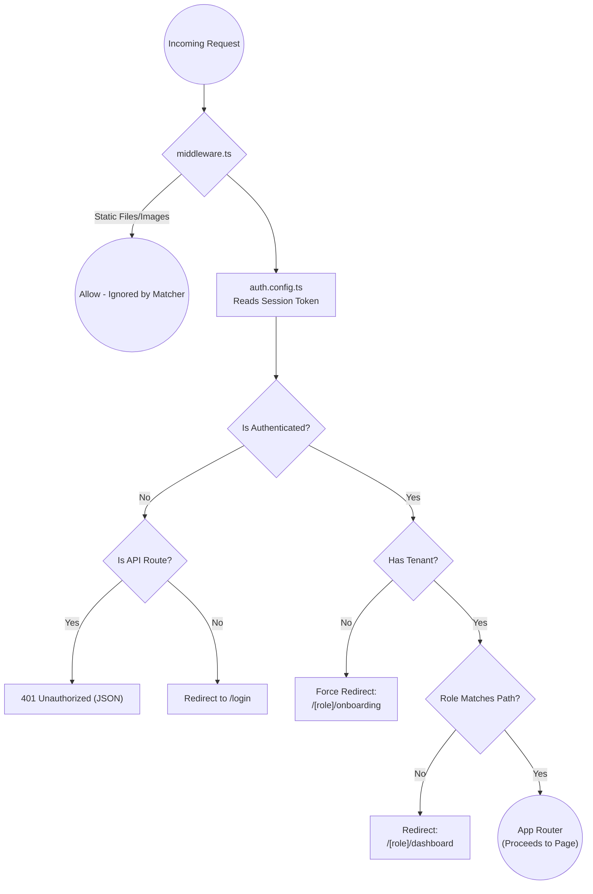

# Middleware Architecture and Flow

This document explains how the Next.js middleware is configured, "filled in," and integrated into the platform using NextAuth.

The middleware acts as a gatekeeper that runs on the edge before a request reaches the application's routes or API endpoints. 

## Project Architecture & Location

Here is where the middleware and related elements live within the dashboard application:

```text
apps/web/dashboard/
├── middleware.ts            <-- The Gatekeeper (routes & API protection)
├── auth.config.ts           <-- "Fills in" the token with role & tenantId
├── auth.ts                  <-- Initializes NextAuth with the DB & Providers
└── app/                     
    ├── api/                 <-- All API routes are protected by middleware
    │   ├── auth/            <-- Handled entirely by NextAuth
    │   └── team/route.ts    <-- Will return 401 if unauthenticated
    ├── (auth)/
    │   ├── login/page.tsx   <-- Redirects to dashboard if already logged in
    │   └── register/page.tsx 
    └── (app)/
        └── [role]/
            ├── dashboard/   <-- Accessible only by matching role & has tenant
            └── onboarding/  <-- Forced destination if user lacks a tenantId
```

## Request Flow Diagram



Here is how the flow works step-by-step:

## 1. The Entry Point: `middleware.ts`
Located at the root of the dashboard app (`apps/web/dashboard/middleware.ts`), this file intercepts incoming requests. 

At the bottom of this file, there is a `matcher` configuration:
```typescript
export const config = {
  matcher: ["/((?!_next/static|_next/image|favicon.ico).*)"],
}
```
This configuration ensures that the middleware runs for every single request **EXCEPT** static files, images, and the favicon. Crucially, because `/api` is not excluded here, backend API routes are also intercepted and protected.

## 2. Attaching NextAuth (`auth.config.ts`)
The middleware is wrapped by NextAuth using the configuration from `auth.config.ts`:
```typescript
export default NextAuth(authConfig).auth((req) => { ... })
```

When a user logs in, NextAuth creates a JWT (JSON Web Token). The `jwt` and `session` callbacks in `auth.config.ts` are responsible for "filling in" this token with custom data from the database:
- It extracts the `user.role` (e.g., `"ADMIN"`, `"EMPLOYEE"`) and appends it to the token.
- It extracts the `user.tenantId` (the user's workspace ID) and appends it to the token.

## 3. The Logic and Routing Rules
Because `auth.config.ts` populated the token with custom data, the middleware can read it directly from `req.auth?.user` without querying the database on every request. 

Inside the middleware, it executes the following core logic:
- **Authentication**: Checks if the user is logged in (`!!req.auth`).
- **Role Extraction**: Reads the user's `role` and normalizes it (e.g., `SUPER_ADMIN` becomes `superadmin`).
- **Tenant Check**: Verifies if the user has a `tenantId`.

Based on this data, it makes strict routing decisions:

1. **API Protection**: If the request is for an `/api` route (and not `/api/auth`) and the user isn't logged in, it blocks the request and returns a `401 Unauthorized` JSON response.
2. **Onboarding Enforcement**: If the user is logged in but lacks a `tenantId`, they are forcefully redirected to `/[role]/onboarding`. If they try to access the main dashboard without a tenant, they are blocked.
3. **Role-based Dashboards**: If an authenticated user tries to access the root (`/`) or `/login`, they are routed directly to their specific dashboard (`/[role]/dashboard`).
4. **Role Isolation**: It checks the URL the user is trying to access. If an `employee` tries to access `/admin/...`, the middleware catches the mismatch and redirects them back to their authorized dashboard.

## Summary
The middleware is "filled in" by the NextAuth `auth.config.ts` callbacks, which inject the user's `role` and `tenantId` into the session token. The `middleware.ts` file then intercepts every request, reads that token, and acts as a traffic controller to ensure users only reach the exact pages and APIs they are authorized to access.
