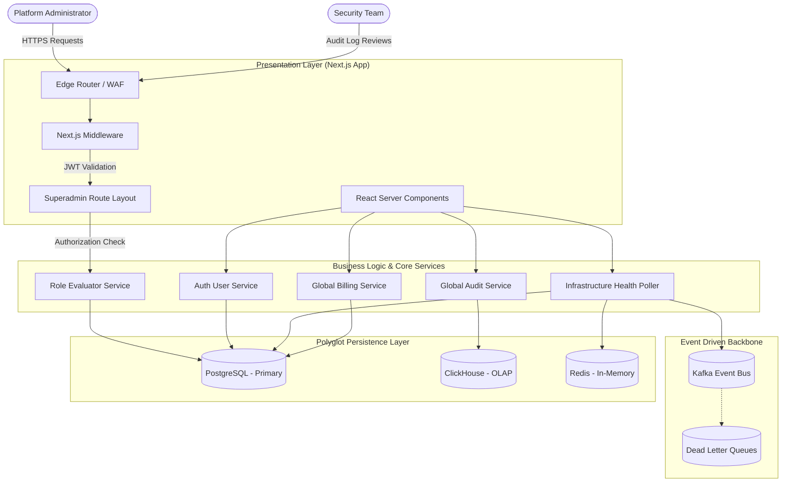
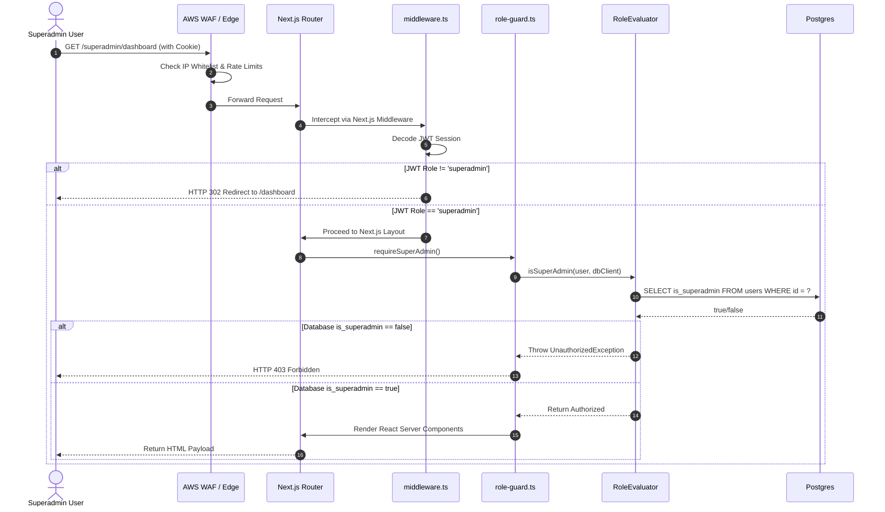
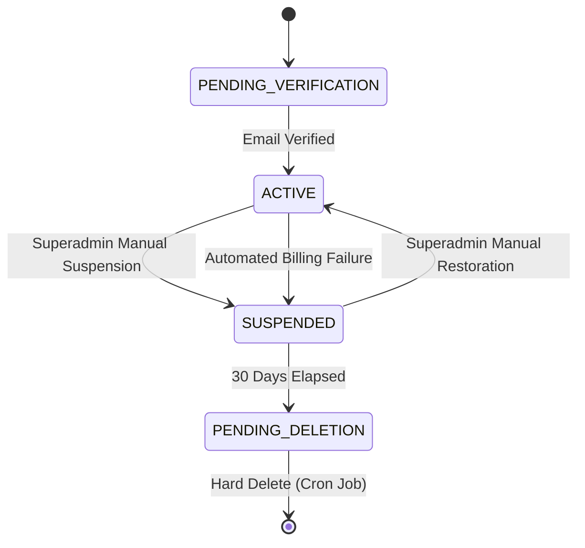

# Comprehensive Architecture and Design Specification: Superadmin Module

## 1. Executive Summary and Strategic Context

### 1.1 Purpose and Vision
The **Superadmin** module is the central administrative nervous system of the Error Tracking and Application Performance Monitoring (APM) platform. In a strictly multi-tenant architecture, individual users (whether they are developers, managers, or organization owners) are cryptographically and logically confined to their specific tenant boundaries (Organizations or Workspaces). This isolation is critical for security and data privacy. 

However, to operate, maintain, and scale a SaaS platform, internal infrastructure engineers, support staff, and platform owners require a vantage point that transcends these tenant boundaries. The Superadmin module provides this "god-mode" global visibility. It enables authorized personnel to monitor cross-tenant system health, manage all underlying organizations, oversee global billing and configurations, and enforce platform-wide security policies. Because of the immense power this role wields, the design of this module prioritizes defense-in-depth security, strict auditability, and isolated data access patterns.

### 1.2 Non-Functional Requirements (NFRs)
- **Zero-Trust Security & Strict Isolation**: The superadmin interface must be protected by rigorous, impenetrable server-side validation. Hiding UI elements on the client side is fundamentally insufficient. Every single API route, server action, and page load must independently re-verify the superadmin cryptographic token.
- **Immutable Auditability (WORM)**: Every mutation (create, update, delete) performed by a superadmin must be immutably recorded in a centralized audit log. This log must operate on a Write-Once-Read-Many (WORM) principle to prevent a compromised superadmin account from covering its tracks.
- **Performance Under Contention**: Cross-tenant analytical queries (e.g., calculating global ingestion rates across 10,000 organizations) must be heavily optimized. The superadmin dashboard must rely on read-replicas, materialized views, or dedicated OLAP databases (like ClickHouse) to prevent "noisy neighbor" impacts on the transactional (Postgres) database.
- **High Availability & Fault Tolerance**: The superadmin health dashboard must remain operational even if downstream microservices (like ingestion, processing, or grouping) degrade. It serves as the primary diagnostic tool during a major incident.

### 1.3 Design Rationale: Why Are We Having This Discussion?

When building a standard application, administrative roles are often implemented simply by adding an `isAdmin` boolean flag and rendering a few extra buttons on the frontend. So, why does the Superadmin module for this platform require such a massive, heavily fortified architectural specification?

The answer lies in the fundamental nature of a **Multi-Tenant B2B SaaS Platform**.

In our architecture, the highest law of the system is **Tenant Isolation**. Every line of code, every database query (enforced by Row-Level Security), and every API route is explicitly designed to prevent Tenant A from ever seeing Tenant B's data. A data leak between tenants in an error tracking system (which may contain PII, API keys, or sensitive stack traces) is a catastrophic security event.

The Superadmin role is inherently dangerous because it is the **only role designed to intentionally break this law of tenant isolation**. 

Because a Superadmin can see all tenants, mutate global billing, and suspend organizations, a compromised Superadmin account (or a poorly written Superadmin query) isn't just a minor bug—it is an existential threat to the entire platform. 

Therefore, this detailed discussion and strict architectural design are mandatory. We must ensure that:
1. **The God-Mode is Quarantined**: Superadmin data access patterns are physically separated from standard user patterns to prevent accidental leaks.
2. **Trust is Verified, Never Assumed**: We cannot trust a simple JWT cookie for these actions, as cookies can be stolen or become stale. We must query the authoritative database on every single request.
3. **The Watchers are Watched**: By implementing strict, WORM (Write-Once-Read-Many) audit logs in ClickHouse, we ensure that if a Superadmin makes a mistake (or goes rogue), there is an immutable, forensic trail of their actions that they themselves cannot delete.

In short, we are having this deep architectural discussion because we are building a secure "glass box" around the most dangerous capabilities in the system.

---

## 2. High-Level Architecture (HLD)

### 2.1 System Context and Topology

The Superadmin module operates primarily within the Next.js `web` application but requires highly specialized data access patterns to communicate with the `core` services, event streaming platforms, and underlying datastores. It bypasses standard API gateways that enforce tenant routing to execute global administrative commands.



### 2.2 Global Data Persistence Strategy

The application leverages a polyglot persistence architecture. Standard tenant queries are heavily constrained by Row-Level Security (RLS) in PostgreSQL or `tenant_id` partitioning in ClickHouse. The Superadmin module requires a dedicated, highly privileged data access strategy.

1. **PostgreSQL (Transactional Data)**: Contains Users, Organizations, API Keys, and Roles. The Superadmin uses a specialized database connection pool that bypasses `SET app.current_tenant` commands, allowing `SELECT * FROM organizations` to execute freely.
2. **ClickHouse (Analytical Data)**: Contains raw error events, performance metrics, and the global audit log. The Superadmin executes massive `GROUP BY tenant_id` aggregations here to determine system-wide ingestion volume.
3. **Redis (State & Caching)**: Contains rate-limiting buckets and active session data. The Superadmin module directly queries Redis to monitor active connections, eviction rates, and memory fragmentation.

---

## 3. Security and Authorization Model

The authorization model is the most critical component of the Superadmin design. A compromised superadmin account could lead to global data breaches or complete platform deletion.

### 3.1 Defense-in-Depth Authorization Flow

The authorization flow operates in multiple consecutive layers. Passing one layer does not guarantee access; all layers must successfully resolve.



### 3.2 Role Evaluator Core Logic
The `RoleEvaluator` class adheres strictly to the **Single Responsibility Principle (SRP)**. Its sole purpose is to compute authorization truths.

```typescript
// packages/core/main/src/services/role-evaluator.ts

import { IAuthUser, IUserReader } from '../interfaces';

export class RoleEvaluator {
  /**
   * Evaluates if a user possesses global superadmin privileges.
   * This performs a strict database check to prevent JWT staleness exploitation.
   */
  async isSuperAdmin(user: IAuthUser, dbClient: IUserReader): Promise<boolean> {
    if (!user || !user.id) return false;

    // Fast-fail: If the JWT doesn't even claim to be a superadmin, reject immediately.
    const rawRole = String(user.role).toUpperCase().trim();
    const isClaimingSuperAdmin = ['SUPER_ADMIN', 'SUPERADMIN', 'OWNER'].includes(rawRole);
    
    if (!isClaimingSuperAdmin) {
      return false;
    }
    
    // Strict Verification: Query the authoritative database.
    // This ensures that if a superadmin is demoted, their active JWT cannot be used.
    try {
      const isVerified = await dbClient.checkSuperAdminMembership(user.id);
      return isVerified;
    } catch (error) {
      // Fail secure: If the database cannot be reached, deny access.
      console.error(`Failed to verify superadmin status for ${user.id}`, error);
      return false;
    }
  }
}
```

---

## 4. Sub-Module Low-Level Design (LLD)

The Superadmin module is divided into several highly cohesive sub-modules, each adhering to the **Interface Segregation Principle (ISP)** by maintaining distinct API contracts and specialized UI views.

### 4.1 Global Dashboard & Ingestion Metrics
**Purpose**: Provide an immediate, real-time snapshot of the platform's health and throughput.

- **Metrics Tracked**: 
  - Events ingested per second (EPS) across all tenants.
  - Number of active API keys processing traffic.
  - Active background jobs in BullMQ.
- **Data Source**: Primarily ClickHouse (for EPS) and Redis (for active connections).
- **Architecture Note**: To prevent the dashboard from causing Denial of Service (DoS) on ClickHouse via heavy aggregations, EPS metrics are calculated by a background cron job every 10 seconds and cached in Redis. The dashboard reads exclusively from the Redis cache.

### 4.2 Cross-Tenant Organizations Management
**Purpose**: Allow administrators to manage the lifecycle, billing tier, and security posture of every tenant on the platform.



**Key Features**:
- **Force Suspension**: Immediately invalidates all API keys for the tenant, stopping the ingestion pipeline to protect platform resources from abusive traffic spikes or spam.
- **Tier Overrides**: Manually upgrade a tenant to `ENTERPRISE` tier, bypassing the standard Stripe billing flow (useful for custom contracts or sales demos).

### 4.3 Global User Identity Management
**Purpose**: Manage the platform's user directory. 

**Key Features**:
- **Audit Trails per User**: View every action a specific user has taken across any organization they belong to.
- **MFA/2FA Reset**: If a user loses their authenticator app, a superadmin can cryptographically reset their 2FA requirement (this action requires the superadmin themselves to re-authenticate).
- **Impersonation (Optional & Highly Restricted)**: Generates a temporary, scoped JWT that allows a support engineer to view the UI exactly as the customer sees it. *Note: Impersonation sessions MUST NOT have write privileges.*

### 4.4 Infrastructure Health Monitoring
**Purpose**: Provide a direct line of sight into the underlying infrastructure, bypassing standard application abstractions.

The Next.js Server Components communicate directly with specialized Admin Clients:
- **Redis Poller**: Executes `INFO memory` and `INFO clients` to detect connection leaks or imminent Out of Memory (OOM) crashes.
- **Kafka Poller**: Instantiates a `Kafka.Admin` client to execute `describeCluster()` and `fetchOffsets()`. It calculates the exact lag between the `ingestion` service producing events and the `processing` service consuming them. A spike in lag triggers a dashboard alert.
- **Postgres Poller**: Executes `SELECT * FROM pg_stat_activity WHERE state = 'active' AND query_start < NOW() - INTERVAL '5 minutes'`. This identifies long-running, deadlocked queries that require manual termination.

### 4.5 Centralized Audit Logging
**Purpose**: Ensure strict compliance and tracking of all superadmin actions.

**Data Schema (`global_audit_logs` in ClickHouse)**:
```sql
CREATE TABLE global_audit_logs (
    id UUID,
    timestamp DateTime64(3),
    actor_id UUID,
    actor_email String,
    action_type Enum8('SUSPEND_ORG' = 1, 'TIER_UPGRADE' = 2, 'USER_DELETE' = 3, 'FEATURE_FLAG_TOGGLE' = 4),
    target_resource_id String,
    old_state JSON,
    new_state JSON,
    ip_address String,
    user_agent String
) ENGINE = MergeTree()
ORDER BY (timestamp, action_type);
```
**Important**: The `web` application is granted `INSERT` only permissions to this ClickHouse table. `UPDATE` and `DELETE` commands are strictly revoked at the database user level, enforcing immutability.

### 4.6 Global Files Management (`/superadmin/files`)
**Purpose**: Allow superadmins to oversee, audit, and manage system-wide file uploads, attachments, and static assets across all tenants (e.g., uploaded crash dumps, source maps, or user avatars).

**Key Features**:
- **Cross-Tenant Storage Visibility**: View aggregated S3/MinIO bucket usage, identifying which tenants are consuming the most storage space.
- **Orphaned File Cleanup**: Identify and securely purge files that are no longer linked to active records (e.g., source maps for deleted projects) to manage infrastructure costs.
- **Compliance & Takedowns**: Ability to force-delete or quarantine specific files if they violate terms of service or contain malicious payloads, overriding tenant ownership.
- **Data Access Bypass**: Similar to the PostgreSQL strategy, the `SuperAdminFiles` component (`apps/web/dashboard/components/superadmin-files.tsx`) interfaces with an S3/Blob client that is not scoped to a specific `tenant_id` prefix, allowing directory traversals and operations at the bucket root level.

---

## 5. API Contracts & Technical Specifications

While the Next.js app heavily utilizes Server Components, certain interactive client-side operations require dedicated RESTful API routes. Every route must implement the `requireSuperAdmin` guard.

### 5.1 Suspend Organization API
This endpoint halts all ingestion and access for a specific tenant.

**HTTP Request**:
`POST /api/superadmin/organizations/{orgId}/suspend`

**Headers**:
- `Authorization: Bearer <jwt_token>`
- `x-superadmin-mfa-token: <totp_code>` (Required for high-risk actions)

**Request Payload**:
```json
{
  "reason": "Excessive API abuse detected. Violates terms of service.",
  "suspendIngestionKeys": true,
  "suspendUserLogins": true,
  "notifyAdmins": true
}
```

**Response (200 OK)**:
```json
{
  "success": true,
  "data": {
    "organizationId": "org_987654321",
    "previousState": "ACTIVE",
    "newState": "SUSPENDED",
    "keysInvalidated": 14,
    "auditReferenceId": "aud_11223344"
  }
}
```

**Response (403 Forbidden - Role Escalation Attempt)**:
```json
{
  "error": "Forbidden",
  "message": "Insufficient privileges. Action logged."
}
```

### 5.2 System Feature Flag Override API
Allows the superadmin to globally disable specific platform features during an incident (e.g., disabling the alerting pipeline if it is causing a cascading failure).

**HTTP Request**:
`PATCH /api/superadmin/config/feature-flags`

**Request Payload**:
```json
{
  "flagKey": "ENABLE_SLACK_ALERTING",
  "globalState": false,
  "incidentReference": "INC-4099"
}
```

---

## 6. Operational Hardening and Disaster Recovery

### 6.1 Network Security and WAF Configuration
The Superadmin module must not be accessible via the public internet without additional layers of security.
- **IP Whitelisting**: The AWS WAF (Web Application Firewall) or Cloudflare configuration must drop any requests to the `/superadmin/*` path that do not originate from the company's internal VPN CIDR blocks.
- **Rate Limiting**: Superadmin login attempts are strictly rate-limited to 5 attempts per 15 minutes. Subsequent attempts result in an automatic temporary IP ban and trigger an alert to the Security Operations Center (SOC).

### 6.2 The "Break Glass" Procedure
In the event of a catastrophic failure where the primary authentication database (Postgres) goes offline, standard superadmin logins will fail.
- **Solution**: A static, heavily encrypted "Break Glass" credential is injected into the `gateway` service via secure environment variables (e.g., AWS Secrets Manager). This credential bypasses the database check but strictly requires a hardware security key (YubiKey) to authenticate via an emergency route (`/superadmin/emergency-login`).

### 6.3 Audit Log Retention and WORM
To comply with SOC2 and ISO27001 standards:
- ClickHouse audit logs are continuously backed up to an Amazon S3 bucket configured with Object Lock in Compliance Mode. This guarantees that for a minimum of 7 years, no entity—not even the AWS root account—can overwrite or delete the superadmin audit trail.

---

## 7. Next.js UI Component Architecture

The React component tree for the Superadmin module relies on passing down the `isSuperAdminOverride` context to modify shared UI elements.

```tsx
// apps/web/dashboard/app/(app)/superadmin/layout.tsx

import { requireSuperAdmin } from '../../../lib/role-guard';
import { NavigationShell } from '../../../../components/sidebar';
import { GlobalMetricsProvider } from './_components/MetricsContext';

export default async function SuperAdminLayout({ children }: { children: React.ReactNode }) {
  // 1. Strict Server-Side Guard
  const user = await requireSuperAdmin();

  // 2. Render specialized Layout
  return (
    <div className="superadmin-theme-wrapper border-t-4 border-red-600">
      <GlobalMetricsProvider>
        {/* Pass override flag to modify standard sidebar behavior */}
        <NavigationShell user={user} isSuperAdminOverride={true}>
          <main className="p-8">
            <div className="mb-8">
              <h1 className="text-3xl font-bold tracking-tight text-red-700">
                Global Command Center
              </h1>
              <p className="text-muted-foreground">
                Warning: Actions performed here affect all platform tenants.
              </p>
            </div>
            {children}
          </main>
        </NavigationShell>
      </GlobalMetricsProvider>
    </div>
  );
}
```

The UI utilizes a distinct color palette (e.g., red borders, distinct warning banners) to constantly remind the operator that they are operating in a global, highly privileged context, reducing the likelihood of accidental destructive actions.

---

## 8. Conclusion and Future Scalability

The Superadmin module establishes a highly secure, logically isolated administrative plane on top of a strictly multi-tenant architecture. By adhering to the **SOLID principles**, particularly the Dependency Inversion Principle (relying on `IUserReader` abstractions rather than hardcoded Postgres queries), the module is heavily insulated from future database migrations.

As the platform scales to handle billions of errors per month, the Superadmin module is designed to scale horizontally. The reliance on ClickHouse for analytics and Redis for real-time metrics ensures that the administrative dashboard remains lightning-fast and responsive, providing platform engineers with the critical visibility needed to maintain enterprise-grade reliability.
